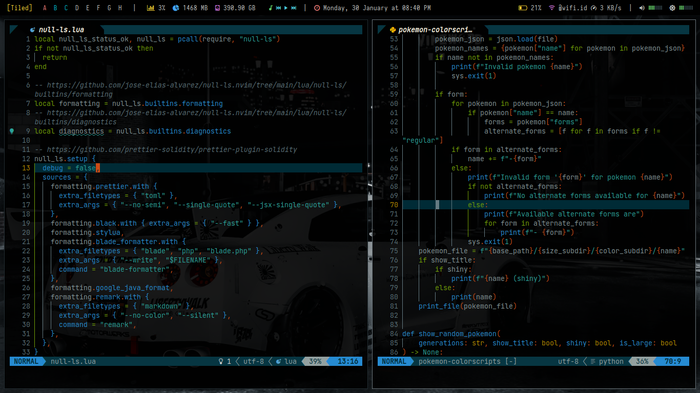

# Renvim

## Table of Contents

*   [Features](#features)
*   [Installation](#installation)
*   [Customizing](#customizing)
    *   [Plugins](#plugins)
    *   [Snippets](#snippets)
    *   [LSP](#lsp)
    *   [Formatting](#formatting)

I've set up this configuration for javascript developers.

> **Warning** - If you wanna try customizing the configuration other than what's given in the documentation, do it at your own risk.

## Features



*   Rich in Plugins
*   Customizing Snippets

[Back to Top](#table-of-contents)

## Installation

You can follow these steps:

```bash
git clone https://github.com/masrenda/renvim
cd renvim
mv nvim ~/$PATH/.config/
```

[Back to Top](#table-of-contents)

## Customizing

<details>
<summary>
Directory Structure
</summary>  
<br>
<pre>
nvim
├── init.lua
├── lua
│   └── user
│       ├── autocommands.lua
│       ├── autopairs.lua
│       ├── bufferline.lua
│       ├── cmp.lua
│       ├── colorscheme.lua
│       ├── comment.lua
│       ├── dap.lua
│       ├── gitsigns.lua
│       ├── illuminate.lua
│       ├── impatient.lua
│       ├── indentline.lua
│       ├── keymaps.lua
│       ├── lsp
│       │   ├── handlers.lua
│       │   ├── init.lua
│       │   ├── mason.lua
│       │   ├── null-ls.lua
│       │   └── settings
│       │       ├── pyright.lua
│       │       └── sumneko_lua.lua
│       ├── lualine.lua
│       ├── neosolarized.lua
│       ├── nvim-tree.lua
│       ├── options.lua
│       ├── plugins.lua
│       ├── project.lua
│       ├── telescope.lua
│       ├── toggleterm.lua
│       └── treesitter.lua
├── plugin
│   └── packer_compiled.lua
└── snippets
    ├── blade
    │   ├── blade.json
    │   ├── helpers.json
    │   ├── livewire.json
    │   ├── package.json
    │   └── snippets.json
    ├── html
    │   ├── html.json
    │   └── package.json
    ├── md
    │   ├── md.json
    │   └── package.json
    └── php
        ├── package.json
        └── php.json
</pre>
</details>

### Plugins

You can delete, edit, or add plugins to the `~/$PATH/nvim/lua/user/plugins.lua` file.

Find `return packer.startup(function(use)`, then add the plugin below it.

```lua
...

return packer.startup(function(use)
  -- My plugins here
  use { "wbthomason/packer.nvim", commit = "6afb67460283f0e990d35d229fd38fdc04063e0a" }
  use { "nvim-lua/plenary.nvim", commit = "4b7e52044bbb84242158d977a50c4cbcd85070c7" }
  use { "windwp/nvim-autopairs", commit = "4fc96c8f3df89b6d23e5092d31c866c53a346347" }
  use { "numToStr/Comment.nvim", commit = "97a188a98b5a3a6f9b1b850799ac078faa17ab67" }

...
```

You don't need to enter `commit` and `{}` there.

[Back to Top](#table-of-contents)

### Snippets

If we look at the directory structure of the `snippets` folder, there's one file in each folder there that shouldn't be renamed, namely: `package.json`

```bash
snippets
├── blade
│   ├── blade.json
│   ├── helpers.json
│   ├── livewire.json
│   ├── package.json    <<
│   └── snippets.json
├── html
│   ├── html.json
│   └── package.json    <<
├── md
│   ├── md.json
│   └── package.json    <<
└── php
    ├── package.json    <<
    └── php.json
```

Let's take one example in the php snippet:

The `package.json` file contains `name`, `version`, `description`, etc.

```json
{
  "name": "php",
  "version": "1.0.0",
  "description": "PHP code snippets",
  "contributes": {
    "snippets": [
      {
        "language": ["php", "blade", "blade.php"],
        "path": "./php.json"
      }
    ]
  }
}
```

In the `php.json` file, that's where the snippet is.

```json
{
  "class …": {
    "prefix": "class",
    "body": [
      "class ${1:ClassName} ${2:extends ${3:AnotherClass}} ${4:implements ${5:Interface}} {",
      "\t$0",
      "}",
      ""
    ],
    "description": "Class definition"
  }
}
```

You can create a snippet by following the example above.

If you don't know what to write in your snippet, you can visit [friendly-snippets](https://github.com/rafamadriz/friendly-snippets/tree/main/snippets) or you can get snippets from the [vscode marketplace](https://marketplace.visualstudio.com/) there.

Once you've created your snippets, you can go straight to the `~/$PATH/.config/nvim/lua/user/cmp.lua` file and register your snippets there.

```lua
...

-- Load custom snippets
require("luasnip/loaders/from_vscode").lazy_load { paths = { "~/.config/nvim/snippets/html" } }
require("luasnip/loaders/from_vscode").lazy_load { paths = { "~/.config/nvim/snippets/php" } }
require("luasnip/loaders/from_vscode").lazy_load { paths = { "~/.config/nvim/snippets/blade" } }
require("luasnip/loaders/from_vscode").lazy_load { paths = { "~/.config/nvim/snippets/md" } }

...
```

[Back to Top](#table-of-contents)

### LSP

If you want to add an LSP, you need to download it from mason. Then register the LSP in the following way:

Go to the `~/$PATH/nvim/lua/user/lsp/mason.lua` file. Then enter the LSP there.

```lua
-- add LSP server
local servers = {
  "sumneko_lua",
  "cssls",
  "html",
  "tsserver",
  "pyright",
  "intelephense",
  "bashls",
  "jsonls",
  "yamlls",
  "vuels",
  "grammarly",
  "tailwindcss",
}

...
```

Then proceed to register the LSP server in the `~/$PATH/nvim/lua/user/lsp/handlers.lua` file.

```lua
-- add LSP server
M.on_attach = function(client, bufnr)

  if client.name == "sumneko_lua" then
    client.server_capabilities.documentFormattingProvider = false
  end

...
```

[Back to Top](#table-of-contents)

### Formatting

Formatter taken from [null-ls.nvim](https://github.com/jose-elias-alvarez/null-ls.nvim/blob/main/doc/BUILTINS.md#formatting). You can see the formatter config on `./nvim/lua/user/lsp/null-ls.lua` file.

```lua
...

-- add formatter here
null_ls.setup {
  debug = false,
  sources = {
    formatting.prettier.with {
      extra_filetypes = { "toml" },
      extra_args = { "--no-semi", "--single-quote", "--jsx-single-quote" },
    },
    formatting.black.with { extra_args = { "--fast" } },
    formatting.stylua,
    formatting.blade_formatter.with {
      extra_filetypes = { "blade", "php", "blade.php" },
      extra_args = { "--write", "$FILENAME" },
      command = "blade-formatter",
    },
    formatting.google_java_format,
    formatting.remark.with {
      extra_filetypes = { "markdown" },
      extra_args = { "--no-color", "--silent" },
      command = "remark",
    },
    diagnostics.flake8,
  },
}
```

[Back to Top](#table-of-contents)
