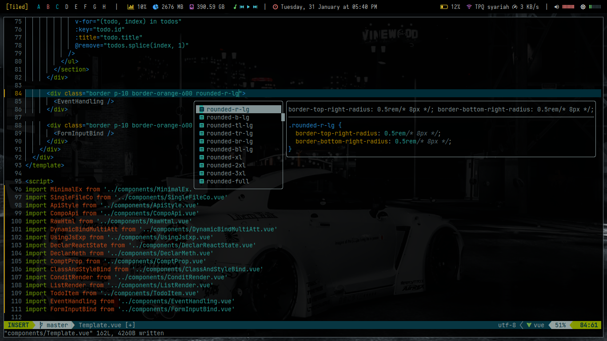
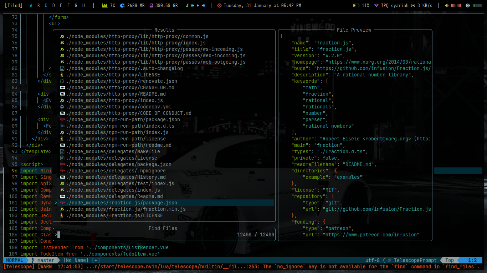

# Renvim dotfiles

I've set this up for Vue, Nuxt, and PHP (soon) developers.

> **Warning** - If you wanna edit the config to your heart's content, that's fine. But, damage to the configuration's at your own risk.

## Features

*   [packer.nvim](https://github.com/wbthomason/packer.nvim)
*   [plenary.nvim](https://github.com/nvim-lua/plenary.nvim)
*   [nvim-autopairs](https://github.com/windwp/nvim-autopairs)
*   [Comment.nvim](https://github.com/wbthomason/packer.nvim)
*   [nvim-ts-context-commentstring](https://github.com/JoosepAlviste/nvim-ts-context-commentstring)
*   [nvim-web-devicons](https://github.com/nvim-tree/nvim-web-devicons)
*   [nvim-tree.lua](https://github.com/kyazdani42/nvim-tree.lua)
*   [vim-bbye](https://github.com/moll/vim-bbye)

## Content

*   (Neo)Vim config
*   Alacritty config
*   tmux config

## Setup

*   Requires [Neovim](https://neovim.io/) (>= 0.8).
*   I used [Alacritty](https://alacritty.org/) as a terminal.

## How to Use

*Coming soon ...*  
*I'll write the doc on docusaurus.*

## Theme Reference

[Takuya's dotfiles](https://github.com/craftzdog/dotfiles-public)
